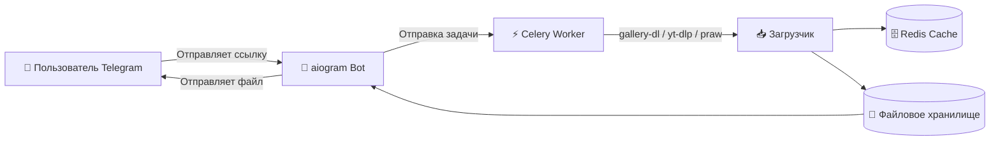

# 🧠 **Telegram Media Downloader Bot** 🎬

Telegram-бот для **скачивания медиа** из популярных социальных сетей:
**Reddit, TikTok, YouTube, RuTube и Instagram**.

Работает **асинхронно**, использует **Celery** для фоновых задач и **Redis** для кэширования.
Поддерживает авторизованные **cookies** для обхода ограничений и приватных видео.

---

## 🚀 **Возможности**

* 📥 **Скачивание видео, изображений и аудио из:**

  * ✅ **YouTube**
  * ✅ **TikTok**
  * ✅ **Reddit**
  * ✅ **RuTube**
  * ✅ **Instagram**

* ⚙️ Поддержка **cookies** для авторизации и обхода возрастных ограничений

* 💾 **Кэширование и временное хранение** через Redis

* 🧩 **Фоновые задачи через Celery** (многопоточность, очередь загрузок)

* 👮‍♂️ **Админ-панель и проверка подписки** на обязательные каналы

* 🔧 **Лёгкая настройка** через `.env`

---

## 🧰 **Технологический стек**

| Компонент                      | Назначение                                           |
| ------------------------------ | ---------------------------------------------------- |
| **🐍 Python 3.13+**            | Основной язык                                        |
| **🤖 aiogram**                 | Telegram Bot API                                     |
| **📸 gallery-dl**              | Загрузка контента из Instagram, TikTok, Reddit и др. |
| **🎬 yt-dlp**                  | Загрузка видео с YouTube и RuTube                    |
| **👾 praw**                    | Работа с Reddit API                                  |
| **⚡ Celery**                   | Асинхронные фоновые задачи                           |
| **🗄️ Redis**                  | Кэш, брокер и временное хранилище                    |
| **🐳 Docker / docker-compose** | Контейнеризация и деплой                             |

---

## ⚙️ **Установка и настройка**

### 1️⃣ Клонируйте репозиторий

```bash
git clone https://github.com/akhmedovh4mid/MediaDownloadTelegramBot.git
cd MediaDownloadTelegramBot
```

---

### 2️⃣ Получите cookies

1. Авторизуйтесь в браузере под аккаунтами:
   **YouTube, TikTok, RuTube, Reddit, Instagram**
2. Экспортируйте cookies (через **Get cookies.txt**)
3. Сохраните файл:

```
.cookies/cookies.txt
```

---

### 3️⃣ Получите Reddit API ключи

1. Перейдите на [https://www.reddit.com/prefs/apps](https://www.reddit.com/prefs/apps)
2. Создайте приложение типа **script**
3. Скопируйте `client_id` и `client_secret`
4. Добавьте их в `.env`

---

### 4️⃣ Настройте `.env`

```env
# === Основные настройки бота ===
BOT_NAME="@ИМЯ_БОТА"
BOT_TOKEN="ВАШ_ТОКЕН_БОТА"
BOT_SERVER_URL="http://telegram-bot-api:8081"  # не менять
BOT_ADMIN_IDS=[123123, 456456]
BOT_SUBSCRIPTION_CHANNELS=["@example_channel"]

# === Telegram API ===
TELEGRAM_HTTP_PORT=8081 # не менять
TELEGRAM_API_ID=28331654
TELEGRAM_API_HASH="fd9a1d29839bdc1c88728e35cc8ed17b"

# === Reddit API ===
REDDIT_CLIENT_ID="AQrzu9B_t86A45z_i-ouQA"
REDDIT_CLIENT_SECRET="RlXUD7Y7CmDONK_pfVUVqpGsDIqSrQ"

# === Redis ===
REDIS_HOST="redis" # не менять
REDIS_PORT=6379 # не менять
REDIS_BROKER_DB=0 # не менять
REDIS_BACKEND_DB=1 # не менять
REDIS_MEDIA_CACHE_DB=2 # не менять
REDIS_USER_SESSION_DB=3 # не менять
REDIS_USER_ACTIVITY_DB=4 # не менять

# === Пути (не менять) ===
BROWSER_COOKIE_PATH="/app/cookies/cookies.txt"
MEDIA_STORAGE_PATH="/app/src/storage/downloads"
```

---

### 5️⃣ Запуск через Docker

#### 🔧 Сборка и запуск контейнеров

```bash
docker compose up -d --build
```

#### 📜 Логи

```bash
docker compose logs -f
```

#### 🧩 Проверка нагрузки

```bash
docker stats
```

#### 🔁 Перезапуск

```bash
docker compose restart
```

---

## 📁 **Структура проекта**

```
├── docker-compose.yaml       # Docker конфигурация
├── Dockerfile                # Сборка образа
├── main.py                   # Точка входа бота
├── pyproject.toml            # Зависимости
├── src/
│   ├── bot/                  # Telegram-логика
│   ├── core/                 # Загрузчики и парсеры (gallery-dl, yt-dlp, praw)
│   ├── celery_app/           # Celery задачи
│   ├── databases/            # Redis и хранилища
│   ├── assets/               # Статика (иконки, изображения)
│   ├── config.py, settings.py
│   └── ...
└── .cookies/cookies.txt      # Cookies для соцсетей
```

---

## ⚙️ **Архитектура**



---

## 🧠 **Полезные команды**

| Команда     | Описание                          |
| ----------- | --------------------------------- |
| `/start`    | Приветствие и запуск              |
| `/help`     | Список доступных команд           |
| `/products` | Дополнительные продукты / сервисы |

---
